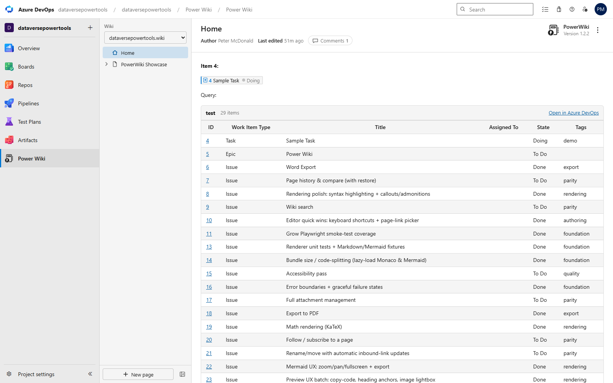
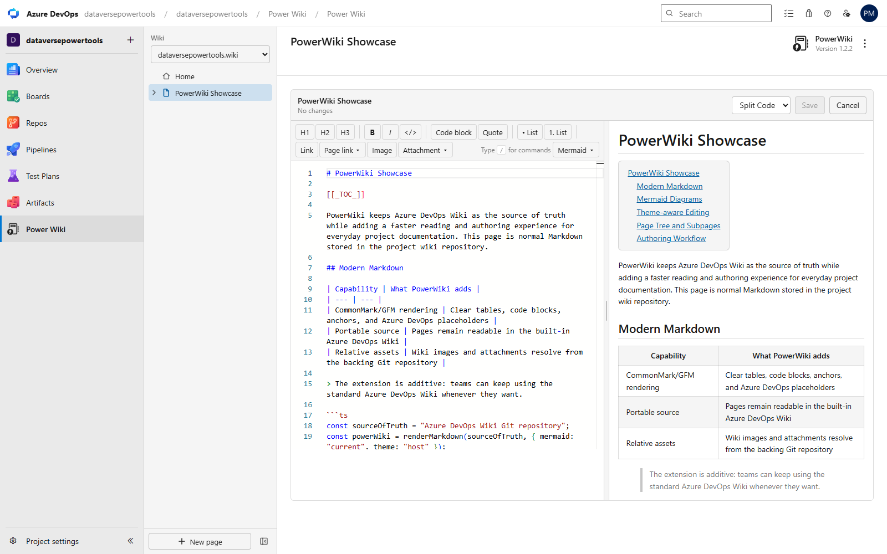
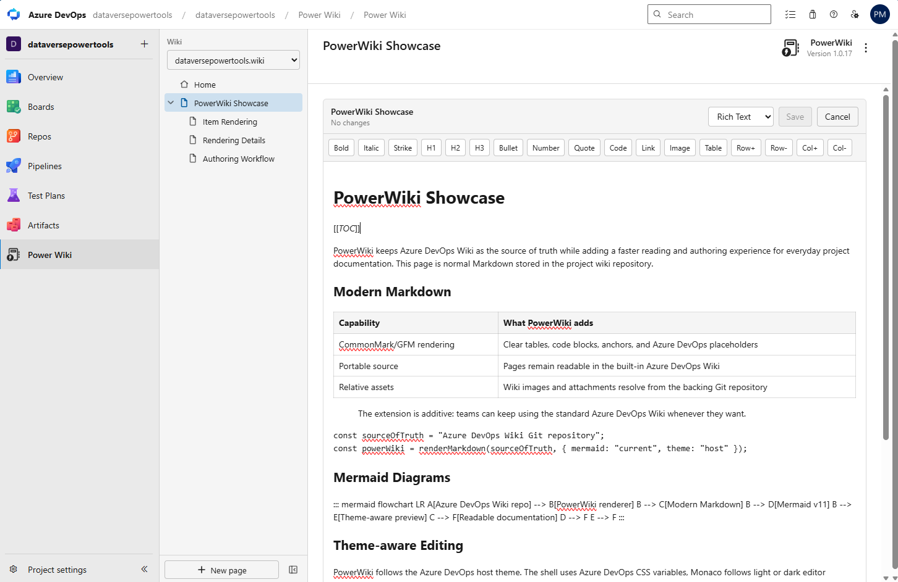

# PowerWiki

PowerWiki brings a modern wiki experience to Azure DevOps without touching your existing content. It adds a **Power Wiki** menu alongside the built-in Azure DevOps Wiki and continues to use your standard wiki Git repositories as the single source of truth.

No migration. No proprietary formats. Just better reading and editing for the Markdown and Mermaid you already have.

## Why PowerWiki?

- Use the latest Markdown and Mermaid rendering instead of the frozen versions bundled in Azure DevOps.
- Edit with a full-featured Monaco editor, the same editor that powers VS Code.
- Get rich Azure Boards integration that still renders as readable plain text in the standard wiki.
- Keep the familiar Azure DevOps Wiki experience available for your whole team. PowerWiki is purely additive.
- Follow Azure DevOps light, dark, and custom themes automatically.

## Key Features

- **Modern rendering**
  - Current CommonMark + GFM pipeline with heading anchors.
  - Syntax-highlighted code blocks with a one-click copy button.
  - GitHub-style callouts / admonitions (`> [!NOTE]`, `[!TIP]`, `[!WARNING]`, etc.), rendered as styled blocks and still readable in the built-in wiki.
  - Hover permalinks on headings (copy a shareable Azure DevOps deep link) and click-to-zoom on images.
  - LaTeX math rendering with KaTeX (`$inline$` and `$$display$$`).
  - Full support for `[[_TOC_]]` and `[[_TOSP_]]` placeholders.
  - Up-to-date Mermaid (v11) — including the latest diagram types (architecture, block, kanban, sankey, xy-chart, requirement) — with automatic light/dark theming, a fit-to-screen pan/zoom fullscreen view, and SVG export. Works with both standard ````mermaid` fences and Azure DevOps-style `::: mermaid` blocks.

- **Powerful editing**
  - Monaco-based Markdown editor with word wrap, syntax awareness, and comfortable editing.
  - Save changes directly back to your Azure DevOps wiki repository.
  - Formatting helpers for headings, emphasis, code, lists, links, and starter Mermaid diagrams.
  - Create new pages, move or reorder pages, and delete pages through Azure DevOps Wiki APIs.

- **Azure Boards enhancements** (portable by design)
  - `#1234` references render as clickable work item badges that open the native work item form.
  - Embed live query results with `::: query-table <query-id> :::`. PowerWiki renders a table of matching work items with a link back to the original query.

- **Navigation & structure**
  - Switch between multiple project wikis.
  - Hierarchical page tree with lazy-loaded children, collapse/expand behavior, and drag-and-drop reorder.
  - Deep linking and in-page navigation that feels native.
  - Relative images and Azure DevOps-hosted wiki images are resolved and displayed correctly.
  - Per-page byline showing the last editor and edit time from the page's Git history, plus top-level wiki comments.
  - Work item badges and embedded query tables stay rendered across page navigation, editor resizing, and live preview edits.

- **Theme aware**
  - Uses Azure DevOps host CSS variables for the PowerWiki UI.
  - Detects light or dark mode from host color luminance rather than hard-coded theme names.
  - Keeps Monaco and Mermaid diagrams aligned with the current Azure DevOps theme.

## Screenshots







## How It Works

PowerWiki reads and writes the exact same wiki pages stored in your project's Azure DevOps Git wiki repositories. Everything you edit is stored as normal Markdown, fully compatible with the built-in Azure DevOps Wiki, clone, and any other tools that consume the repository.

## Requirements & Scope

- Requires an Azure DevOps project with at least one wiki.
- Works for both Azure DevOps Services and Server where extension APIs are available.
- Requests read/write access to Wiki, read access to Work Items, and read access to Code. The Code (read) permission is used only to look up each page's last-edit author and date from the wiki's Git history for the byline.
- Current focus: excellent page viewing, content editing, page tree management, comments, and modern rendering. Full attachment management, full page history/compare, and search are on the roadmap.

Choose the experience that works best for you on any given day. Your wiki content stays exactly where it belongs.
